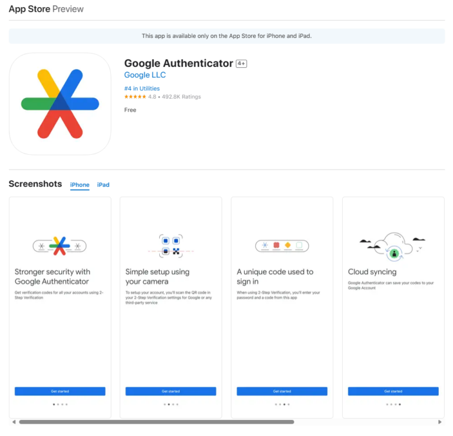
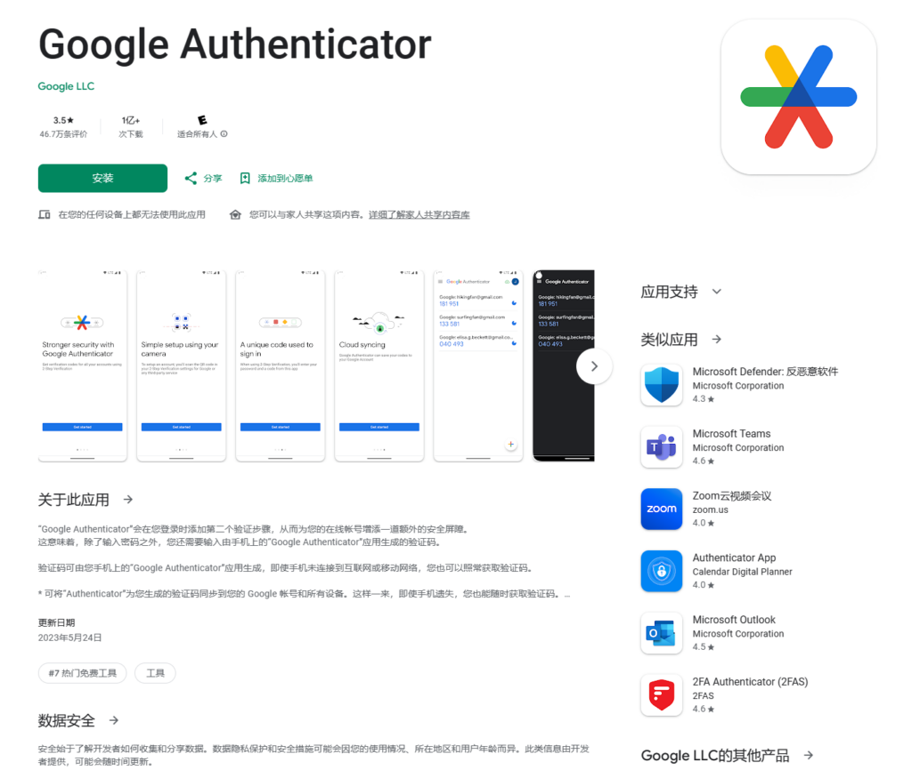
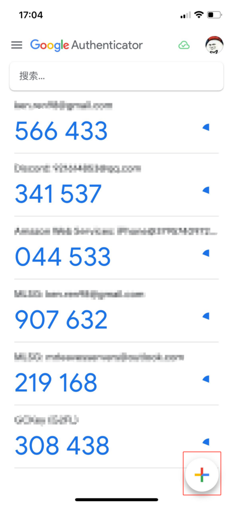
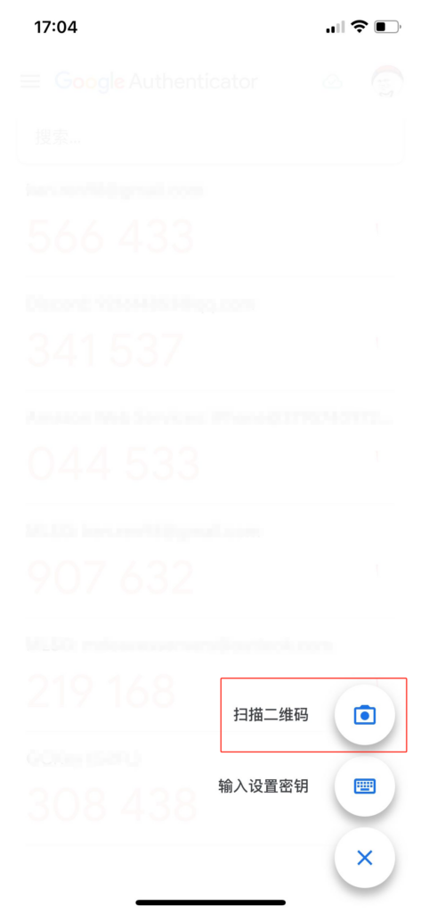
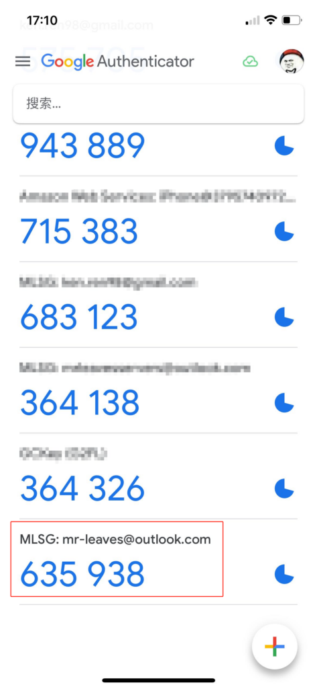

# 注册登录
本文章为MLSG后台的注册教程，请您务必阅读。  
请按照以下指引完成账户设置，方便使用服务器后台功能，大约3-5分钟即可。  

**服务器管理后台网址：[panel.mr-leaves.com](http://panel.mr-leaves.com) （请阅读教程后再访问）**  
  

  
官网顶部左上角点击访问MLSG后台，官网：[mr-leaves.com](http://mr-leaves.com)（非管理页面，请勿注册）  

---

## 1.邀请邮件

在您完成支付后，系统会向您提供的Email发出邮件邀请，邀请您注册登录MLSG后台。
  
 

## 2.设置密码

按照网站指引设置完密码后，点击重置密码，就会跳转到您的账户后台页面。
   
 

## 3.动态口令

由于服务器后台操作涉及玩家数据安全，后台均强制使用2FA动态口令，在新的设备上登录会要求实时验证码，请去[苹果APP Store](https://apps.apple.com/us/app/google-authenticator/id388497605)或者[安卓Google Play](https://play.google.com/store/apps/details?id=com.google.android.apps.authenticator2)市场下载Google Authenticator，并在手机上安装。请在安装完成后再点击启用动态口令认证，以免二维码过期。然后使用Authenticator右下角的+号扫码添加验证器。添加成功后，会弹出救援代码用以一次性使用，请截图或拷贝记录下来。以下为图文教程。
   

  

    
APP Store

    
  

  

    
Google Play

    
  

  
验证器二维码

   
 

  

    
添加

    
  

  

    
扫码

    
  

  

    
使用

    
  

  
一次性紧急救援代码

  

