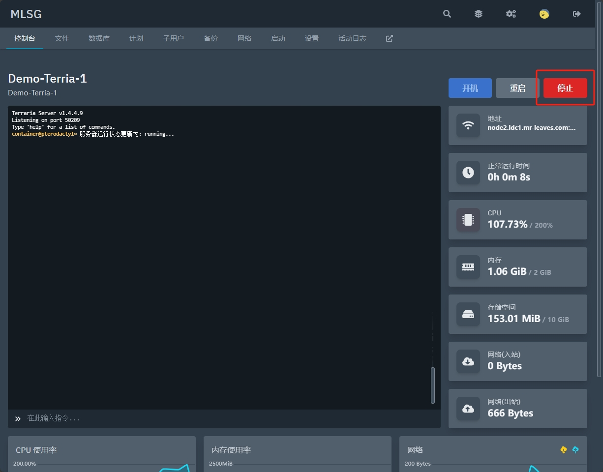
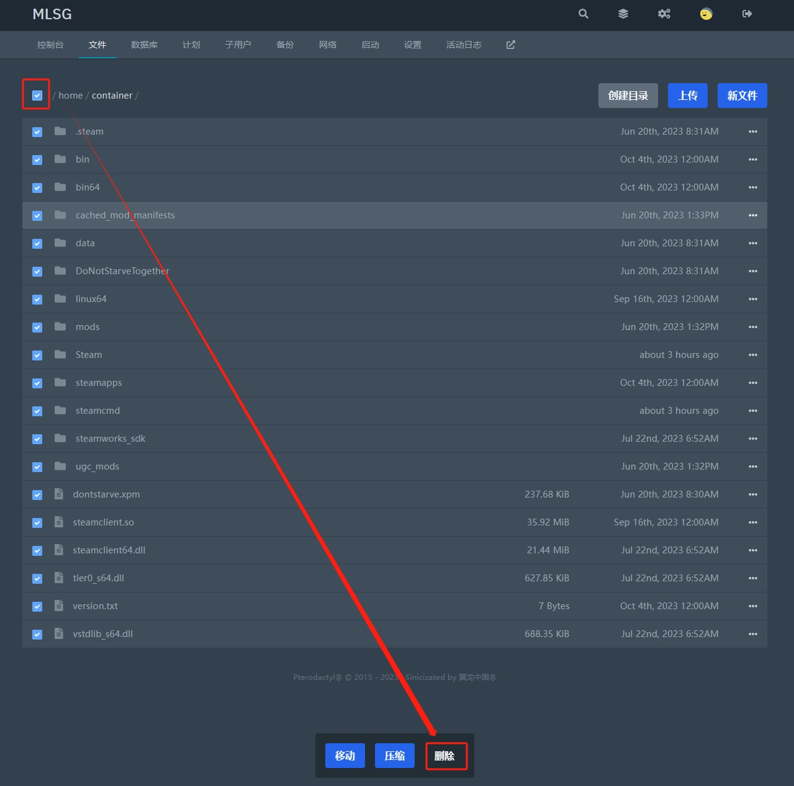
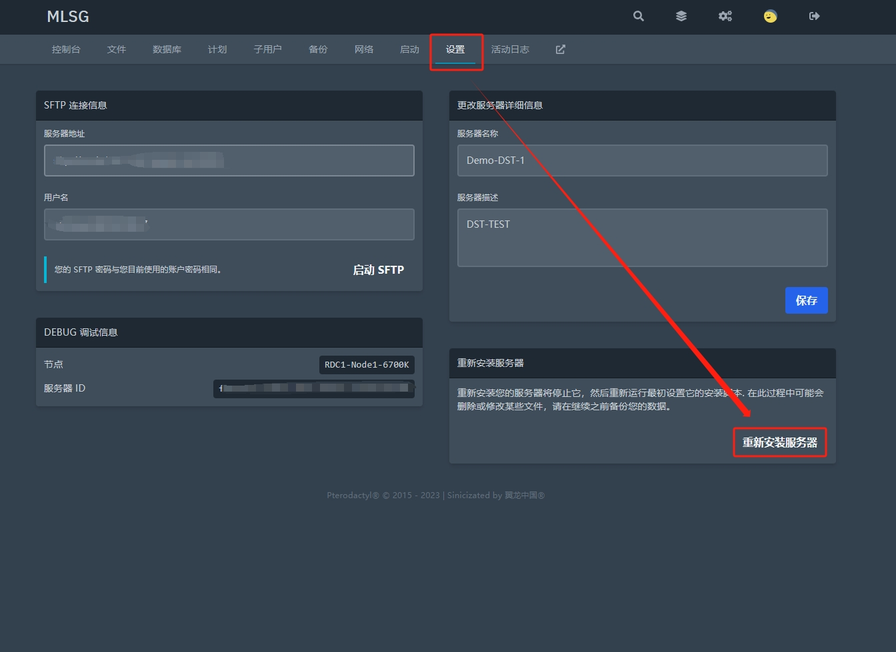

# 服务器软件重装
使用面板自带的**重新安装服务器**按钮，重新运行服务器的安装脚本。  

---

## 1.关闭服务器

使服务器文件得以正常保存，并关闭。  
  
 

## 2.删除所有文件

由于通常安装脚本不会默认删除已有的文件和文件夹，重新安装前，请自行下载存档，之后并删除所有文件！ 
   
 

## 3.重新安装按钮

在**设置**页面找到并按下**重新安装服务器**按钮。
   
 

## 4.等待安装完成

服务器安装完成后，系统会给您发送邮件提醒。